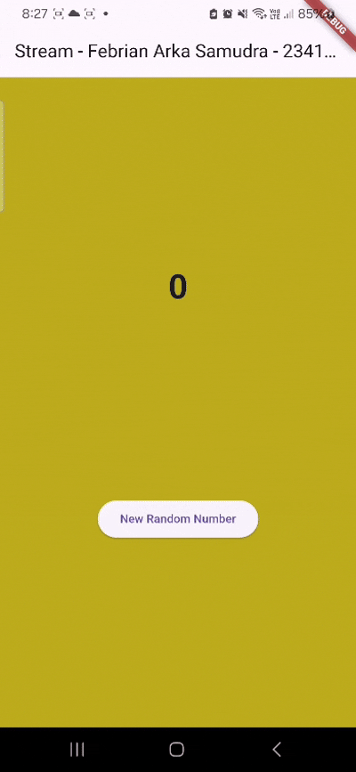
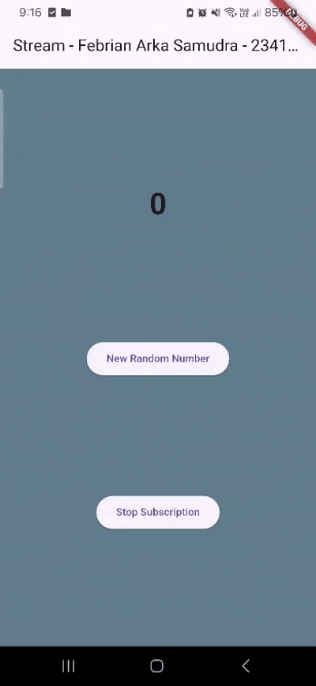
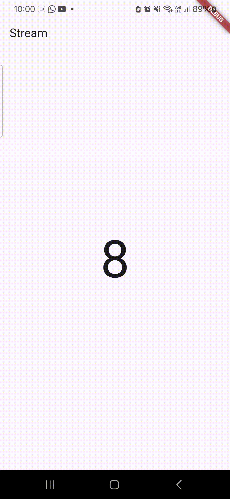

# PRACTICUM 12 
## Practical 1 : Dart Streams

**Question 1**

**Question 2**

**Question 3** 

**Explanation of yield**

yield* in an async* function is used to forward all events from another stream directly into the current one. Rather than emitting each value manually, it automatically relays every event produced by the other stream.

**Explanation of the Code**

The getColors() function produces a stream of color values. It relies on Stream.periodic to emit a new color every second, and the expression t % colors.length makes the sequence cycle continuously. Using yield*, the function passes along every emitted value from the periodic stream, allowing each generated color to be produced as an event in its own stream.

**Question 4**
 

**Question 3**

- listen() uses a callback and lets the program keep running while it reacts to incoming stream events.

- await for processes events one by one, pausing for each value in order, similar to iterating through a loop.

## Practical 2 : Stream controllers and sinks
### Question 6 
**Explain the meaning of the code steps 8 and 10!**
- Step 8 sets up both the color stream and the number stream so the UI can update automatically when new data arrives. 
- Step 10 generates a random number and sends it to the stream, causing the displayed number to update.

### Question 7 
**Explain the meaning of the code steps 13 to 15!**
- Step 13 creates a method that can intentionally trigger an error in the stream.
- Step 15 changes the button so it sends an error to the stream instead of a number.

## Practical 3 : Injecting data into streams
### Question 8 
**Explain the meaning of the code steps 1-3!**
- Step 1 creates a temporary variable that will store the transformation rules for the stream.

- Step 2 specifies how the transformer works: valid numbers are multiplied by 10, while any errors are replaced with the value -1.

- Step 3 attaches this transformer to the stream so the UI listener receives the processed output instead of the original values.

## Practical 4 : Subscribe to stream events
### Question 9
**Explain the meaning of the code step 2, 6, 8**
- Step **2** initializes the `Stream` by taking the controller’s stream and immediately starts listening to incoming events so that every new value updates `lastNumber` in the UI.

- Step **6** defines how the app should react when an error occurs in the stream—any error triggers the `onError` callback, which sets `lastNumber` to `-1` to indicate a failure.

- Step **8** specifies what happens when the stream is finished: the `onDone` callback runs and prints a message, signaling that no more events will be received.

## Practical 5 : Multiple stream subscriptions
### Question 10
**Why the errors happened**
The error *“Bad state: Stream has already been listened to”* occurs because a **single-subscription stream** in Flutter can only have **one active listener**, but your code calls `stream.listen()` twice on the same stream. This causes the second listener to attach to a stream that is already being listened to, triggering the error. To fix it, either convert the stream to a **broadcast stream** using `stream.asBroadcastStream()` or ensure you only use one listener.

### Question 11
**Why that's happened?**
When you convert a normal stream into a broadcast stream using `asBroadcastStream()`, the stream becomes capable of having **multiple listeners**, and each listener receives the same events independently. Since your code listens to the broadcast stream **twice**, every emitted value is delivered to **both listeners**, causing each event to appear **twice** in your output. The stream itself is not generating extra numbers—it's simply sending the same number to multiple listeners, which makes it look like the output has doubled.

## Practical 6 : Stream Builder
### Question 12
**Explain the meaning of the code step 3 and 7**
- Step **3** (inside `getNumbers()`): This step uses `Stream.periodic` to generate a new number every second, and inside the callback it creates a `Random` instance to produce a random integer between 0 and 9. Each generated value is then emitted into the stream using `yield*`, meaning the stream continuously outputs random numbers at fixed 1-second intervals.

- Step **7** (inside `StreamBuilder`): This step receives the latest emitted value from the stream through `snapshot.data` and displays it in a large `Text` widget. Every time the stream sends a new number, the `StreamBuilder` rebuilds the UI and updates the displayed number accordingly, providing real-time updates without manually calling `setState()`.

