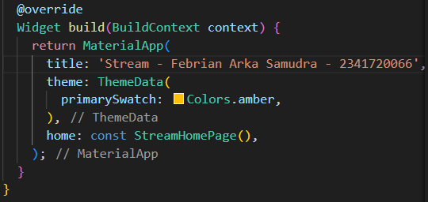
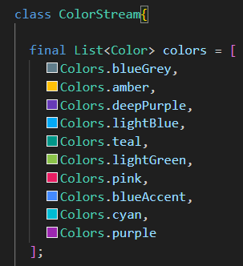
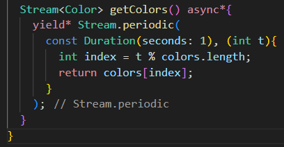
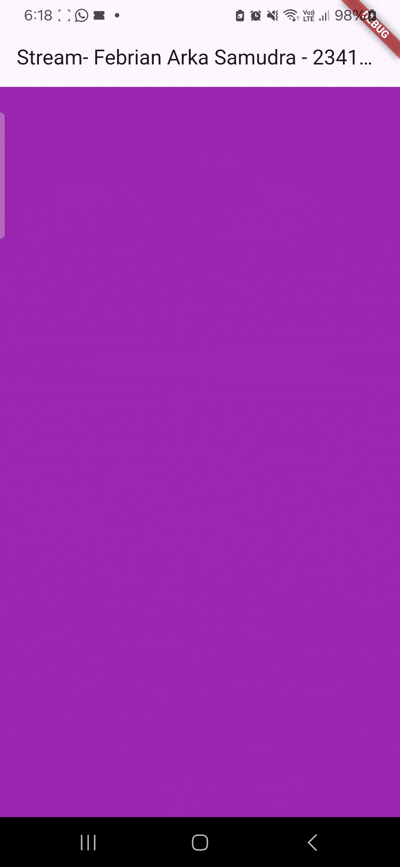
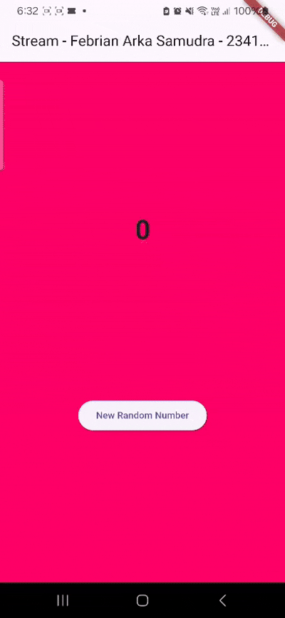
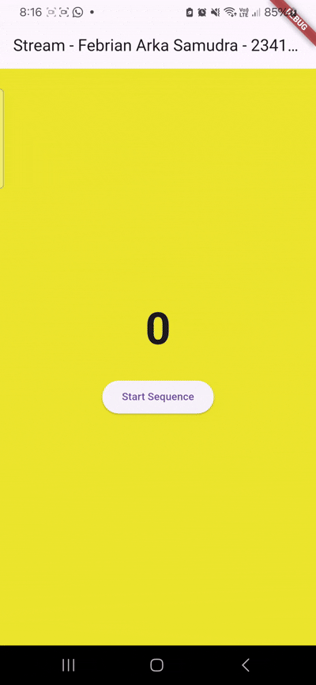

# PRACTICUM 12 
## Practical 1 : Dart Streams

**Question 1**

**Question 2**

**Question 3** 

**Explanation of yield**

yield* in an async* function is used to forward all events from another stream directly into the current one. Rather than emitting each value manually, it automatically relays every event produced by the other stream.

**Explanation of the Code**

The getColors() function produces a stream of color values. It relies on Stream.periodic to emit a new color every second, and the expression t % colors.length makes the sequence cycle continuously. Using yield*, the function passes along every emitted value from the periodic stream, allowing each generated color to be produced as an event in its own stream.

**Question 4**
 

**Question 3**

- listen() uses a callback and lets the program keep running while it reacts to incoming stream events.

- await for processes events one by one, pausing for each value in order, similar to iterating through a loop.

## Practical 2 : Stream controllers and sinks
### Question 6 
**Explain the meaning of the code steps 8 and 10!**
- Step 8 sets up both the color stream and the number stream so the UI can update automatically when new data arrives. 
- Step 10 generates a random number and sends it to the stream, causing the displayed number to update.

### Question 7 
**Explain the meaning of the code steps 13 to 15!**
- Step 13 creates a method that can intentionally trigger an error in the stream.
- Step 15 changes the button so it sends an error to the stream instead of a number.

